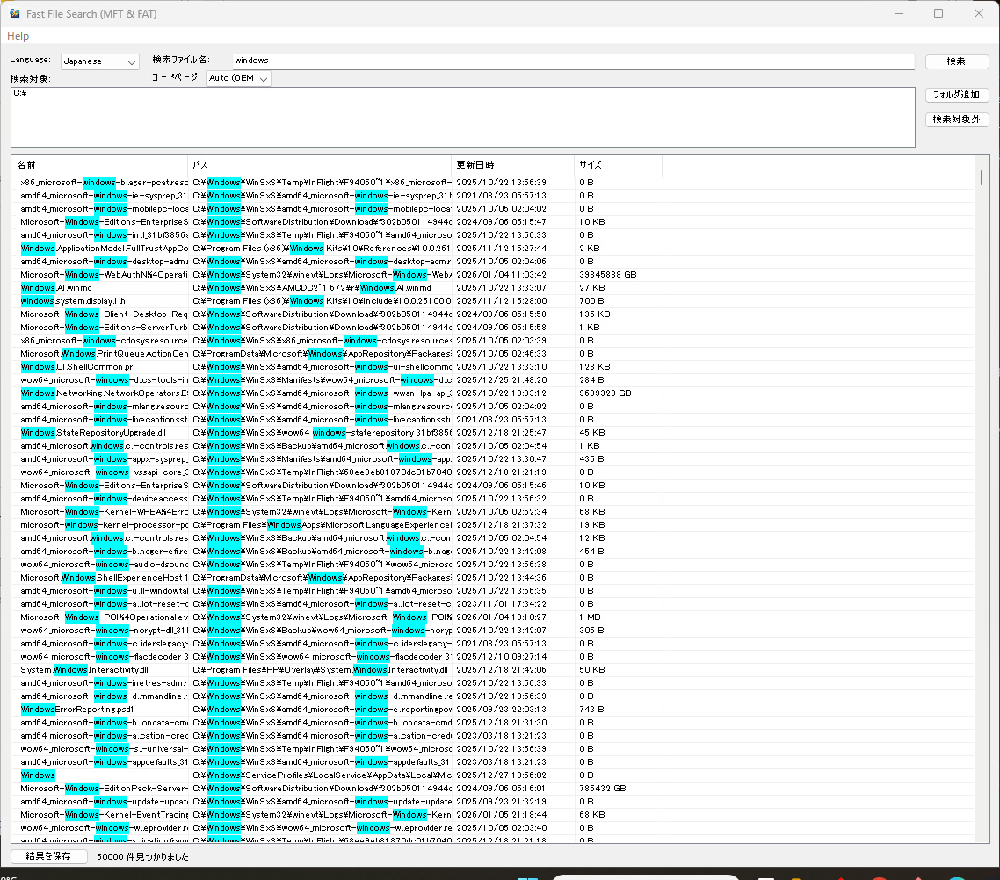

# FastFileSearch


**FastFileSearch** is a high-performance file search utility for Windows. Unlike standard search tools that crawl directories recursively, FastFileSearch reads the file system structures directly (MFT for NTFS, FAT Table for FAT/exFAT) to locate files across millions of records in seconds.

<p align="center">
  
</p>

## ✨ Features

- **🚀 Ultra-Fast Search**: Directly reads raw filesystem structures (MFT/FAT).
- **💾 Multi-Filesystem Support**: 
  - **NTFS**: Instant MFT scanning.
  - **FAT16 / FAT32**: Direct sector reading.
  - **exFAT**: Optimized large volume support.
- **🌍 Multilingual UI**: Seamless switching between English and Japanese.
- **🔦 Smart Visualization**: 
  - Keyword highlighting (Cyan).
  - Sortable columns (Name, Path, Date, Size).
  - Real-time progress updates.
- **🔌 Context Integration**: Right-click results to Copy Path.
- **⚙️ Configurable**: Settings (Window size, language, target folders) persist automatically.
- **📦 Portable**: No installation required, settings saved to `Documents\FastFileSearch`.

## 🛠️ Build Instructions

### Prerequisites
- **CMake** (3.10+)
- **Visual Studio 2022** (MSVC)

### Building with CMake
1. **Clone the repository**:
   ```powershell
   git clone https://github.com/yourusername/FastFileSearch.git
   cd FastFileSearch
   ```

2. **Generate Project Files**:
   ```powershell
   cmake -S . -B build -G "Visual Studio 17 2022" -A x64
   ```

3. **Compile (Release)**:
   ```powershell
   cmake --build build --config Release
   ```

4. **Run**:
   The executable will be located at `build/Release/FastFileSearch.exe`.

## 📖 Usage

1. **Run as Administrator**: This is strictly required to open raw volume handles (e.g., `\\.\C:`).
2. **Select Scope**:
   - The app automatically detects connected drives.
   - Use **"Add Folder"** to filter results to specific directories.
3. **Search**:
   - Type a filename or substring.
   - Click **Search** to scan instantly.
4. **Encoding**:
   - For FAT/exFAT drives with non-ASCII filenames, you can manually select the Code Page (e.g., Shift-JIS, UTF-8) if automatic detection fails.

## 🔧 Debugging & Console Tool

The project includes `test_console.exe` for low-level diagnostics.

**Command**: `test_console.exe [Options] [Drive] [Query]`

| Option | Description |
| :--- | :--- |
| `-v` | **Verbose**. Prints every single file found. |
| `-t` | **Trace**. debugging for MFT/FAT initialization (headers, run lists). |

**Examples**:
```cmd
test_console.exe -t C:          # Trace MFT read on C:
test_console.exe -v D: document # Search "document" on D: showing all matches
```

## 📜 License

This project is open source. See [LICENSE](LICENSE) for details.

---
*Created in collaboration with Antigravity.*
